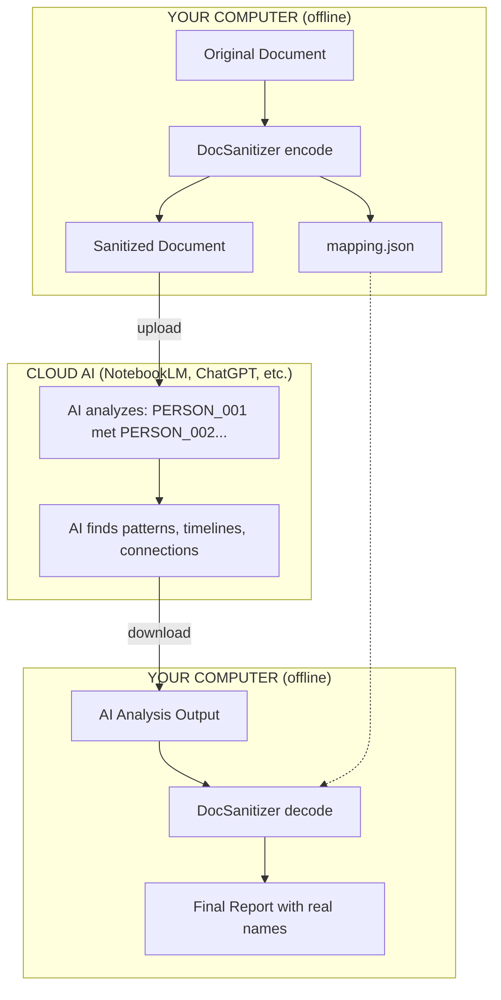

# DocSanitizer

Strip sensitive data from documents for safe AI analysis. Replace names, phone numbers, addresses, vehicles, and more with placeholders while preserving document structure. Decode AI output back to original values.

**The AI never sees the real data.**

## The Story Behind This Tool

> *"4,713 pages. An experienced researcher would need five days to build a timeline. I did it in 20 minutes, during a coffee break."*

This tool was born from a real investigation: a 170-megabyte cocaine smuggling case file containing court orders, wiretap transcripts, cell tower data, arrest warrants, bank statements, and interrogation protocols.

The problem? No AI chatbot could handle it:
- ChatGPT: "Failed upload"
- Gemini: "File larger than 100 MB"
- Claude.ai: "You may not upload files larger than 31 MB"
- NotebookLM: Hidden 500,000-word limit

The solution? **Anonymize locally, analyze in the cloud, decode locally.**

Read the full story: **[Speed reading a massive criminal investigation with AI](https://www.digitaldigging.org/p/speed-reading-a-massive-criminal)** - *How to make sense of 4,713 pages in 20 minutes without leaking data*

## The Concept

```
BEFORE:    "On 16/10/2023, officers arrested John Smith at 123 Harbor Road.
            He was hired by Marcus Johnson."

AFTER:     "On 16/10/2023, officers arrested PERSON_001 at ADDRESS_001.
            He was hired by PERSON_002."

AI OUTPUT: "Timeline shows PERSON_001 arrested on 16/10/2023, connected to
            PERSON_002 who runs COMPANY_001, COMPANY_002 and COMPANY_003"

DECODED:   "Timeline shows John Smith arrested on 16/10/2023, connected to
            Marcus Johnson who runs Hideout 1, Hideout 2 and Hideout 3"
```

**What changes:** Names, locations, phones, emails, IBANs, vehicles, addresses
**What stays:** Structure, relationships, patterns, dates, amounts

## The Workflow



**The AI isn't evidence. It's a flashlight.** It helps you find where to look—in 20 minutes instead of 5 days.

## Quick Start

### Installation

```bash
# Install with spaCy support (recommended)
pip install docsanitizer[spacy]

# Download Dutch language model
python -m spacy download nl_core_news_sm

# Other languages available: en, de, fr, it, es
```

### Command Line

```bash
# Step 1: Sanitize your document
docsanitizer encode investigation.txt --legend

# Creates:
#   investigation_sanitized.txt  ← Send this to AI
#   investigation_mapping.json   ← Keep this LOCAL

# Step 2: Upload sanitized file to NotebookLM/ChatGPT/Claude
#         Ask AI to build timeline, find patterns, etc.

# Step 3: Save AI output, then decode back to real names
docsanitizer decode ai_analysis.txt -m investigation_mapping.json

# Result: Full analysis with real names restored
```

### Python API

```python
from docsanitizer import encode, decode, Mapping

# Encode
text = open("investigation.txt").read()
sanitized, mapping = encode(text, language='nl')

# Save
open("sanitized.txt", "w").write(sanitized)
mapping.save("mapping.json")

# ... send sanitized.txt to AI, get analysis back ...

# Decode
ai_output = open("ai_analysis.txt").read()
final = decode(ai_output, mapping)
open("final_report.txt", "w").write(final)
```

## What Gets Detected

| Category | Examples | What it catches |
|----------|----------|-----------------|
| **PERSON** | `Jan de Vries`, `El Mansouri Brahim` | Names via NER + context patterns |
| **PLACE** | `Antwerpen`, `te Wuustwezel` | Cities, "te X", "richting X" patterns |
| **PHONE** | `+32 489 66 70 88`, `052/26.08.60` | Belgian, Dutch, international formats |
| **EMAIL** | `jan@example.com` | Standard email patterns |
| **IBAN** | `BE44 3770 8065 6345` | European bank accounts |
| **VEHICLE** | `Fiat Ducato`, `BMW X5` | 50+ car brands and models |
| **ROAD** | `N133`, `A12`, `E19` | European road numbering |
| **STREET** | `Stationstraat`, `Koning Albertlaan` | Dutch/Belgian street names |
| **ADDRESS** | `Dorpstraat 31/301` | Full addresses with house numbers |
| **DOB** | `26/04/1993` (near "geboren") | Dates of birth in context |
| **ID** | `123456782` | Dutch BSN (validated), Belgian national numbers |

## FAQ

### Why not just use ChatGPT directly?

**Security.** Criminal investigations, medical records, legal documents—you can't upload these to cloud AI. DocSanitizer lets you get AI analysis without exposing the actual data.

### Can't AI guess who PERSON_001 is from context?

Be careful with unique identifiers:
- ❌ `"PERSON_001, the mayor of Springfield"` → AI might guess
- ❌ `"PERSON_001 arrested in Europe's largest drug bust"` → The event identifies the person
- ✅ `"PERSON_001 transferred money to PERSON_002"` → Structure only, no identification

For maximum paranoia, review the sanitized output before uploading.

### What about scanned PDFs?

DocSanitizer works on text. For scanned documents:
1. First convert PDF to text using OCR (Claude Code can help with this)
2. Then sanitize the text output
3. The original article describes processing 565 scanned pages this way

### Why 6 languages?

Each language has its own spaCy NER model trained on native text:
- `nl` Dutch - `nl_core_news_sm`
- `en` English - `en_core_web_sm`
- `de` German - `de_core_news_sm`
- `fr` French - `fr_core_news_sm`
- `it` Italian - `it_core_news_sm`
- `es` Spanish - `es_core_news_sm`

### Is this admissible in court?

**Yes.** AI doesn't produce evidence—it produces a roadmap. You still verify everything against the original documents. Same way Ctrl+F doesn't break chain of custody, neither does pattern recognition on anonymized data.

Quote from the original article:
> *"Say the AI finds: 'PERSON_A met PERSON_B three days before the transfer to COMPANY_X.' That's not a conclusion you present in court. That's a hint where to look. You go back to the original documents. Page 847, page 1,203, page 3,421. That's where the evidence lives."*

### How accurate is the detection?

Detection uses multiple layers:
1. **spaCy NER** - Context-aware name/location detection
2. **Pattern matching** - High-confidence for structured data (phones, emails, IBANs)
3. **Context markers** - Catches "te Wuustwezel", "richting Antwerpen" that NER might miss

Always do a test run with `--dry-run` to see what gets detected.

### What if it misses something?

The `--dry-run` flag shows exactly what will be replaced. If something is missed:
1. Check if it's a pattern we should add
2. For one-off cases, manually edit before uploading
3. Report issues on GitHub

### Can I process multiple documents with consistent placeholders?

Yes. Reuse the same mapping:

```python
mapping = Mapping()
for doc in documents:
    sanitized, mapping = encode(doc, mapping=mapping)
# PERSON_001 refers to the same person across all documents
```

## Real-World Results

From the original investigation:
- **Input:** 170 MB PDF, 4,713 pages, 1,053,356 words
- **After conversion:** 13.8 MB text (92% smaller)
- **Processing time:** 20 minutes (vs 5 days manual)
- **Output:** Complete timeline with all connections mapped

The machine does what machines do well—pattern recognition, repetitive extraction, organizing chaos. You do what humans do well—judgment, context, and knowing when something smells wrong.

## Supported Languages

| Code | Language | Model |
|------|----------|-------|
| `nl` | Dutch | `nl_core_news_sm` |
| `en` | English | `en_core_web_sm` |
| `de` | German | `de_core_news_sm` |
| `fr` | French | `fr_core_news_sm` |
| `it` | Italian | `it_core_news_sm` |
| `es` | Spanish | `es_core_news_sm` |

## Advanced Options

### Anonymization Strategies

```bash
docsanitizer encode doc.txt --strategy replace  # PERSON_001 (default, reversible)
docsanitizer encode doc.txt --strategy redact   # [PERSON] (not reversible)
docsanitizer encode doc.txt --strategy mask     # J** d* V**** (partial)
docsanitizer encode doc.txt --strategy hash     # a1b2c3d4 (one-way)
```

### Detection Backends

```bash
docsanitizer encode doc.txt --backend hybrid    # spaCy + patterns (default)
docsanitizer encode doc.txt --backend patterns  # patterns only (no spaCy needed)
```

### Preview Detection

```bash
docsanitizer encode doc.txt --dry-run  # Shows what would be replaced
docsanitizer analyze doc.txt           # Full detection statistics
```

## Credits & Attribution

### Original Story
**[Speed reading a massive criminal investigation with AI](https://www.digitaldigging.org/p/speed-reading-a-massive-criminal)**
*How to make sense of 4,713 pages in 20 minutes without leaking data*
By Henk van Ess, January 2026

### Code Sources
- Anonymization strategies based on [mstack.nl](https://mstack.nl/blogs/anonymize-pii-llm/)
- spaCy NER integration follows [spaCy documentation](https://spacy.io/)
- BSN validation uses Dutch [11-proef algorithm](https://nl.wikipedia.org/wiki/Burgerservicenummer)
- Optional: [Microsoft Presidio](https://github.com/microsoft/presidio), [GLiNER](https://github.com/urchade/GLiNER)

### Added by Henk van Ess
- Vehicle brand/model detection
- Road number detection (N/A/E/R)
- Context-based location detection
- Context-based name detection
- Legend generation for AI context
- Large file chunking support
- Real-world testing and validation

## License

CC0 1.0 Universal - Public Domain

---

*"That's the real skill nowadays: knowing which buttons to press, and knowing when to stop pressing and start thinking."*
